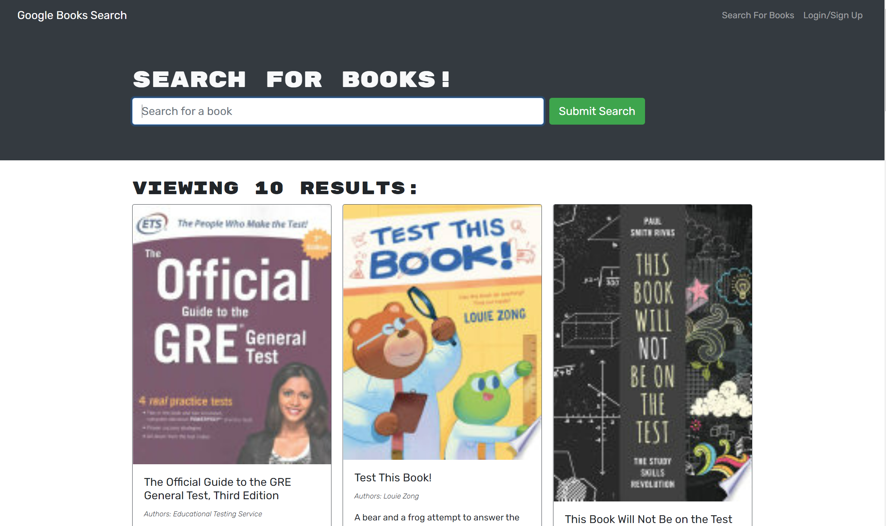

# Book Search & Save <!-- omit in toc --> 

## Table of Contents <!-- omit in toc --> 
- [Description](#description)
- [Installation](#installation)
- [Usage](#usage)
- [Contributing](#contributing)
- [Tests](#tests)
- [Questions](#questions)
- [License](#license)

## Description
A convenient way to search Google Books and save titles that may be interesting to you. You can see the books you've saved and remove a book at any time.

## Installation
- Ensure you have a MongoDB instance running and available
- Clone the repo and CD into the repo folder
- Run `npm run install` to install all necessary dependencies
- run `npm run debug` to start both the client and server together. 
- To start the client or server separately, cd into the respective `/client` or `/server` directory and type `npm run start` to start that component. Note that BOTH components must be running for the project to work. 

## Usage
After starting both the client and server, open a web browser and navigate to http://localhost:3001 to start using the site.

## Contributing
At this point in time we are not accepting outside contributions, but watch this space for changes soon!

## Tests
We currently do basic functional testing as part of our development processes. Automated testing is in the planning phases.

## Questions
Feel free to contact me if you have questions about this project via email as below:
* Owner: Chris Mullendore
* Email: chris@vindage.com
* GitHub Profile: https://github.com/cmullendore-bootcamp

## License
Licensed under the Apache License 2.0 available at http://choosealicense.com/licenses/apache-2.0/
    